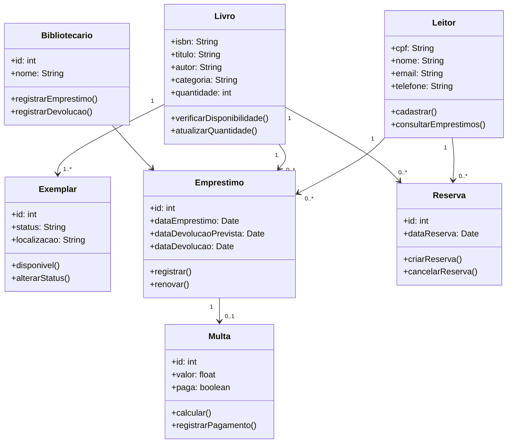
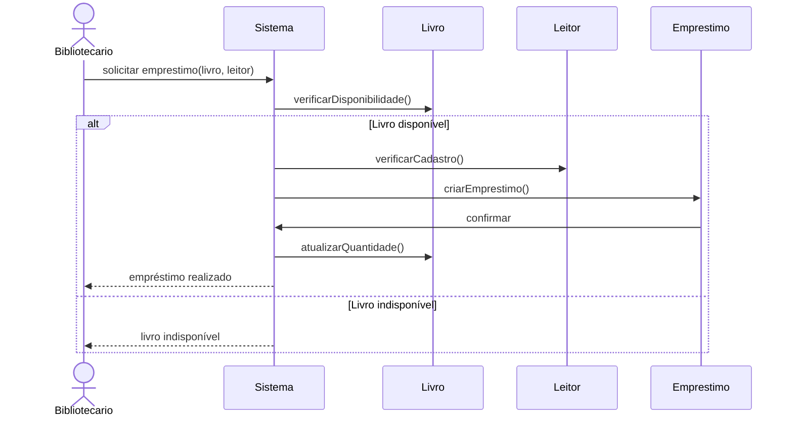
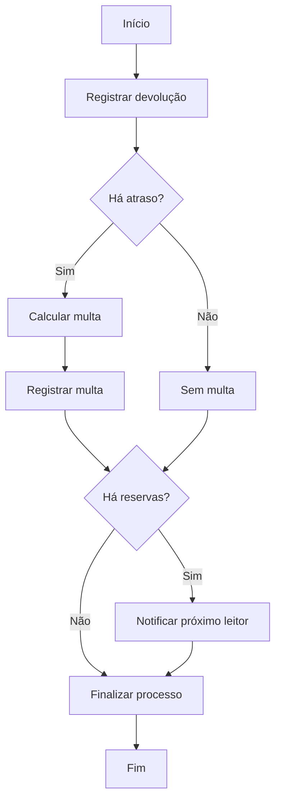

# Modelagem UML - BiblioTech

## Diagrama de Classes

```mermaid
classDiagram

class Livro {
  +isbn: String
  +titulo: String
  +autor: String
  +categoria: String
  +quantidade: int
  +verificarDisponibilidade()
  +atualizarQuantidade()
}

class Exemplar {
  +id: int
  +status: String
  +localizacao: String
  +disponivel()
  +alterarStatus()
}

class Leitor {
  +cpf: String
  +nome: String
  +email: String
  +telefone: String
  +cadastrar()
  +consultarEmprestimos()
}

class Emprestimo {
  +id: int
  +dataEmprestimo: Date
  +dataDevolucaoPrevista: Date
  +dataDevolucao: Date
  +registrar()
  +renovar()
}

class Reserva {
  +id: int
  +dataReserva: Date
  +criarReserva()
  +cancelarReserva()
}

class Bibliotecario {
  +id: int
  +nome: String
  +registrarEmprestimo()
  +registrarDevolucao()
}

class Multa {
  +id: int
  +valor: float
  +paga: boolean
  +calcular()
  +registrarPagamento()
}

Livro "1" --> "1..*" Exemplar
Leitor "1" --> "0..*" Emprestimo
Livro "1" --> "0..*" Emprestimo
Leitor "1" --> "0..*" Reserva
Livro "1" --> "0..*" Reserva
Emprestimo "1" --> "0..1" Multa
Bibliotecario --> Emprestimo
```

---

## Diagrama de Sequência - Realizar Empréstimo

```mermaid
sequenceDiagram

actor Bibliotecario
participant Sistema
participant Livro
participant Leitor
participant Emprestimo

Bibliotecario ->> Sistema: solicitar emprestimo(livro, leitor)
Sistema ->> Livro: verificarDisponibilidade()

alt Livro disponível
    Sistema ->> Leitor: verificarCadastro()
    Sistema ->> Emprestimo: criarEmprestimo()
    Emprestimo ->> Sistema: confirmar
    Sistema ->> Livro: atualizarQuantidade()
    Sistema -->> Bibliotecario: empréstimo realizado
else Livro indisponível
    Sistema -->> Bibliotecario: livro indisponível
end
```

---

## Diagrama de Atividades - Devolução e Reservas

```mermaid
flowchart TD

A[Início] --> B[Registrar devolução]
B --> C{Há atraso?}

C -- Sim --> D[Calcular multa]
D --> E[Registrar multa]

C -- Não --> F[Sem multa]

E --> G{Há reservas?}
F --> G

G -- Sim --> H[Notificar próximo leitor]
G -- Não --> I[Finalizar processo]

H --> I
I --> J[Fim]
```
